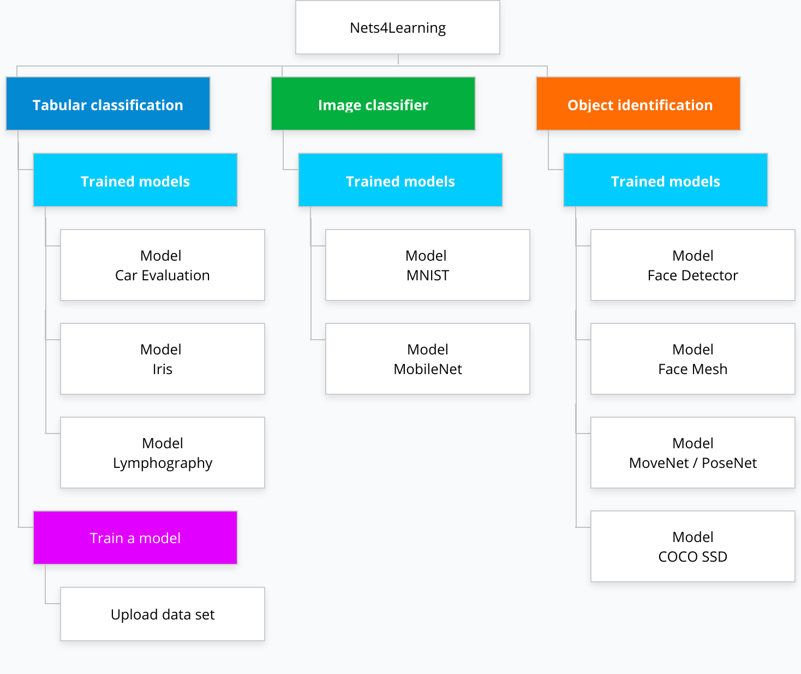
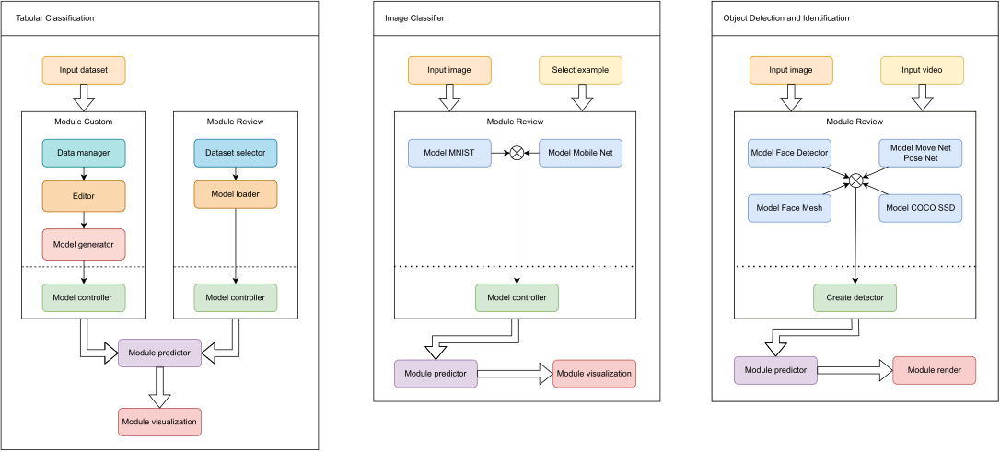

Nets4Learning
=============

Web platform for the design and execution of deep learning models for learning and initiation in the study of deep learning models.

The tool proposes different classical machine learning problems with known data sets to study and model different neural network architectures and training parameters. The tool addresses different examples of deep learning models such as
tabular classification, image classifier or object identification.

There are some classical problems prepared and reviewed to make predictions, the tool has the feature to preprocess data sets that the user uploads, train models and predict in which class it would be classified.



## Architecture Playground



## MODELS

1. Tabular classification
   - [MODEL_CAR.js](src/pages/playground/0_TabularClassification/models/MODEL_CAR.js)
   - [MODEL_IRIS.js](src/pages/playground/0_TabularClassification/models/MODEL_IRIS.js)
   - [MODEL_LYMPHOGRAPHY.js](src/pages/playground/0_TabularClassification/models/MODEL_LYMPHOGRAPHY.js)
2. Linear regression
   - [MODEL_1_SALARY.js](src/pages/playground/1_LinearRegression/models/MODEL_1_SALARY.js)
   - [MODEL_2_AUTO_MPG.js](src/pages/playground/1_LinearRegression/models/MODEL_2_AUTO_MPG.js)
   - [MODEL_3_BOSTON_HOUSING.js](src/pages/playground/1_LinearRegression/models/MODEL_3_BOSTON_HOUSING.js)
   - [MODEL_4_BREAST_CANCER.js](src/pages/playground/1_LinearRegression/models/MODEL_4_BREAST_CANCER.js)
   - [MODEL_5_STUDENT_PERFORMANCE.js](src/pages/playground/1_LinearRegression/models/MODEL_5_STUDENT_PERFORMANCE.js) 
3. Image classifier
    - [MODEL_IMAGE_MNIST.js](src/pages/playground/3_ImageClassification/models/MODEL_IMAGE_MNIST.js)
    - [MODEL_IMAGE_MOBILENET.js](src/pages/playground/3_ImageClassification/models/MODEL_IMAGE_MOBILENET.js)
4. Object identification
    - [MODEL_FACE_DETECTOR.js](src/pages/playground/2_ObjectDetection/models/MODEL_FACE_DETECTOR.js)
    - [MODEL_FACE_MESH.js](src/pages/playground/2_ObjectDetection/models/MODEL_FACE_MESH.js)
    - [MODEL_MOVE_NET_POSE_NET.js](src/pages/playground/2_ObjectDetection/models/MODEL_MOVE_NET_POSE_NET.js)
    - [MODEL_COCO_SSD.js](src/pages/playground/2_ObjectDetection/models/MODEL_COCO_SSD.js)

## Install local

```bash
npm install
```

```dosini
NODE_OPTIONS=--max-old-space-size=4096
```

### Project environment variables

Create the files `.env.development` or `.env.production`.

```dosini
HTTPS=false
WATCHPACK_POLLING=true
FAST_REFRESH=true
NODE_ENV="development"

PUBLIC_URL="http://localhost:3000/n4l"

REACT_APP_ENVIRONMENT="development"
REACT_APP_PATH="/n4l"
REACT_APP_PUBLIC_URL="http://localhost:3000/n4l"
REACT_APP_GA_MEASUREMENT_ID="G-XXXXXXXXXX"
REACT_APP_SHOW_NEW_FEATURE="true"
REACT_APP_NEW_FEATURE="linear-regression"
```

### Development


```bash
node -v 
# v18.16.1
npm -v 
# 9.5.1
```

```bash
npm run start:development
```

### Build

```bash
npm run build:production
```

### Command matrix

|             | development                 | build                      |
|-------------|-----------------------------|----------------------------|
| Development | `npm run start:development` |                            |
| Production  | `npm run start:production`  | `npm run build:production` |
| simidat     |                             | `npm run build:simidat`    |

