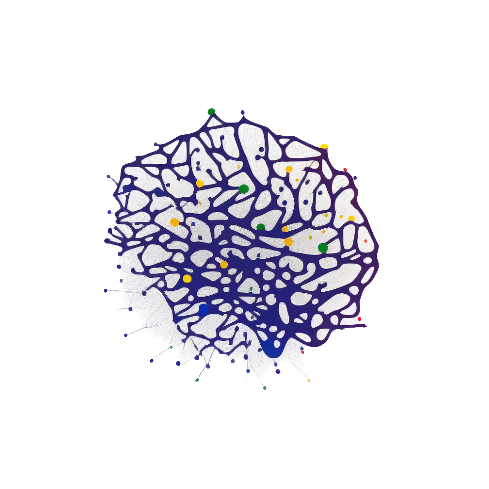

<p align="center">
  
</p>

<h1 align="center">Nets4Learning</h1>

<p align="center">
  Design, train and explain deep learning models in the browser, for learning and teaching.
</p>

<p align="center">
  <a href="https://simidat.ujaen.es/n4l/"><strong>Open the app</strong></a> ·
  <a href="https://simidat.ujaen.es/n4l/manual">Manual</a> ·
  <a href="https://doi.org/10.3390/electronics13224378">Paper</a> ·
  <a href="CHANGELOG.md">Changelog</a> ·
  <a href="LICENSE.md">MIT License</a>
</p>

---

Nets4Learning is a web platform for getting started with deep learning. It poses classic machine learning problems with
well-known datasets. You can then build a neural network layer by layer, choose its training hyperparameters, train it
and compare the results. You can also try pre-trained models and see why they make each prediction.

Everything runs in the browser with [TensorFlow.js](https://www.tensorflow.org/js): there is no server to install and
your data never leaves your computer.

The platform is described in the paper [*Nets4Learning: A Web Platform for Designing and Testing ANN/DNN
Models*](https://doi.org/10.3390/electronics13224378) (Electronics, 2024). If you use it in your work, please
[cite it](#citation).

## Features

- **Four tasks:** tabular classification, regression, object detection and image classification.
- **Training in the browser:** layer editor, optimizers, loss functions, metrics and live training charts
  (tfjs-vis). You can train several models and compare them.
- **Your own data:** upload a CSV, then clean, encode and scale its columns before training.
- **Pre-trained models** for each task, ready to try with examples, your own images, a drawing canvas or the webcam.
- **Explainability:** SHAP for tabular data, regression and images, and LRP (layer-wise relevance propagation) for the
  handwriting models.
- **Learning material:** a step-by-step manual, a glossary (activation functions, optimizers, losses, metrics),
  dataset descriptions and an exploratory data analysis page.
- **Three languages:** English, Spanish and Japanese. The default language comes from the browser and is remembered
  once you change it.

## Tasks, datasets and models

| Task                                                                          | Train with a dataset                                                                                                                                                                                                                                                                                                                                                                                  | Pre-trained models                                                                                 | Explainability |
| ----------------------------------------------------------------------------- | ----------------------------------------------------------------------------------------------------------------------------------------------------------------------------------------------------------------------------------------------------------------------------------------------------------------------------------------------------------------------------------------------------- | -------------------------------------------------------------------------------------------------- | -------------- |
| [Tabular classification](src/pages/playground/0_TabularClassification/models) | Your CSV, [Car evaluation](https://archive.ics.uci.edu/dataset/19/car+evaluation), [Iris](https://archive.ics.uci.edu/dataset/53/iris), [Lymphography](https://archive.ics.uci.edu/dataset/63/lymphography)                                                                                                                                                                                           | Car evaluation, Iris, Lymphography                                                                 | SHAP           |
| [Regression](src/pages/playground/1_Regression/models)                        | Your CSV, [Salary](https://www.kaggle.com/datasets/saquib7hussain/experience-salary-dataset), [Auto MPG](https://archive.ics.uci.edu/dataset/9/auto+mpg), [Housing prices](https://www.cs.toronto.edu/~delve/data/boston/bostonDetail.html), [Student performance](https://archive.ics.uci.edu/dataset/320/student+performance), [Wine quality](https://archive.ics.uci.edu/dataset/186/wine+quality) | Auto MPG, Student performance, Wine quality                                                        | SHAP           |
| [Object detection](src/pages/playground/2_ObjectDetection/models)             | -                                                                                                                                                                                                                                                                                                                                                                                                     | Face detector, Face mesh, MoveNet (pose), COCO-SSD, face-api (age, gender, expression), Hand signs | SHAP           |
| [Image classification](src/pages/playground/3_ImageClassification/models)     | [MNIST](https://yann.lecun.com/exdb/mnist/) (digits), [KMNIST](https://github.com/rois-codh/kmnist) (Japanese characters)                                                                                                                                                                                                                                                                             | MNIST, KMNIST (98.3 % test accuracy), MobileNet V2                                                 | SHAP, LRP      |

## Tech stack

React 19, TypeScript 5.9 and Vite 7, with:

- TensorFlow.js 4.22 and tfjs-vis for the models;
- danfo.js for dataframes;
- React-Bootstrap for the interface;
- Chart.js and Plotly for charts;
- i18next for translations;
- Vitest and Testing Library for tests.

## Getting started

Requirements: **Node.js ≥ 22** and **pnpm 12**. The exact pnpm version is pinned in `package.json`, and Corepack
installs it for you.

```bash
corepack enable
pnpm install
pnpm dev
```

The app is served at <http://localhost:5173/n4l/>.

### Scripts

| Command                               | What it does                                                                                         |
| ------------------------------------- | ---------------------------------------------------------------------------------------------------- |
| `pnpm dev`                            | Development server with hot reload                                                                   |
| `pnpm build:simidat`                  | Type-check and build for [simidat.ujaen.es/n4l](https://simidat.ujaen.es/n4l/) (served under `/n4l`) |
| `pnpm preview`                        | Serve the last build locally                                                                         |
| `pnpm test`                           | Run the tests in watch mode (`pnpm test run` runs them once)                                         |
| `pnpm test:ui` / `pnpm test:coverage` | Tests in the Vitest UI / with coverage                                                               |
| `pnpm lint`                           | ESLint                                                                                               |
| `pnpm version`                        | Update `CHANGELOG.md` from the commit history                                                        |

The build is memory-hungry. If it runs out of memory, run it with
`NODE_OPTIONS="--max-old-space-size=8192"`, as the Docker image does.

### Environment variables

Vite reads `.env` and then `.env.<mode>`. The three files are versioned:

- `.env` for development;
- `.env.simidat` for SIMIDAT;
- `.env.netlify` for Netlify.

The app uses these variables:

| Variable                 | Purpose                                                                                                                                                                                            |
| ------------------------ | -------------------------------------------------------------------------------------------------------------------------------------------------------------------------------------------------- |
| `VITE_PATH`              | Path the app is served under: `"/n4l"` or `""` for the domain root. It also sets Vite's `base`.                                                                                                    |
| `VITE_ENVIRONMENT`       | `development` enables i18next debug logs, shorter default training and development panels. Any value other than `production` also enables the development-only pages, `/debug` and the test pages. |
| `VITE_GA_MEASUREMENT_ID` | Google Analytics 4 measurement ID.                                                                                                                                                                 |
| `VITE_SHOW_NEW_FEATURE`  | `"true"` shows sections that are still in progress (glossary, datasets page).                                                                                                                      |

## Deployment

### Docker

The [Dockerfile](Dockerfile) builds the app with pnpm and serves it with an unprivileged nginx under `/n4l/`. It uses
the `simidat` mode by default; change it with the `BUILD_MODE` build argument.

```bash
docker compose up --build -d
```

The app is then served at <http://localhost:3000/n4l/>. In production, Traefik routes requests to the container on
port 80 (see the comments in [docker-compose.yml](docker-compose.yml) and [nginx.conf](nginx.conf)).

## Project structure

```text
public/
  datasets/ models/                 Datasets and pre-trained models
  docs/ locales/                    Manual and translations (en, es, ja)
src/
  pages/playground/<task>/models/   One class per dataset or model
  core/                             Training, dataframes, explainability
  components/                       Shared UI
  DATA_MODEL.ts                     What each menu lists
  MODEL_KEYS.ts                     Dataset and model identifiers
Scripts/                            Dataset and model generation
tests/                              Vitest tests
```

To add a dataset or a pre-trained model:

1. Create its class in `src/pages/playground/<task>/models/` and register it in that folder's `index.ts`.
2. Add its key to [`MODEL_KEYS.ts`](src/MODEL_KEYS.ts) and its menu option to [`DATA_MODEL.ts`](src/DATA_MODEL.ts).
3. Add its texts to `public/locales/*/translation.json` and its files to `public/datasets/` or `public/models/`.

## Contributing

- Commits follow [Conventional Commits](https://www.conventionalcommits.org/); commitlint checks them.
- Before opening a pull request, run `pnpm lint`, `pnpm test run` and `pnpm build:simidat`. The build also
  type-checks the project.
- New interface texts go into the three translation files. Manual pages go into `public/docs/{en,es,ja}`.

## Team

Developed by the [SIMIDAT](https://simidat.ujaen.es) research group (Intelligent Systems and Data Mining) of the
[University of Jaén](https://www.ujaen.es), with the support of the [DaSCI](https://dasci.es) institute.

- **Direction:** Antonio Jesús Rivera Rivas, María Dolores Pérez Godoy, María José del Jesus Díaz.
- **Development:** [Antonio Mudarra Machuca](https://github.com/nonodev96),
  [David Valdivia Vico](https://github.com/Davavico22), [Carlos Requena](https://github.com/El-Requedaddy).

## Citation

Mudarra Machuca, A., Valdivia, D., Ducange, P., Germán Morales, M., Rivera Rivas, A. J. and Pérez Godoy, M. D. (2024).
Nets4Learning: A Web Platform for Designing and Testing ANN/DNN Models. *Electronics*, 13(22), 4378.
<https://doi.org/10.3390/electronics13224378>

```bibtex
@article{mudarra2024nets4learning,
  author  = {Antonio Mudarra Machuca and David Valdivia and Pietro Ducange and Manuel Germ{\'a}n Morales and Antonio Jes{\'u}s Rivera Rivas and Mar{\'\i}a Dolores P{\'e}rez Godoy},
  title   = {Nets4Learning: A Web Platform for Designing and Testing ANN/DNN Models},
  journal = {Electronics},
  year    = {2024},
  volume  = {13},
  number  = {22},
  pages   = {4378},
  issn    = {2079-9292},
  doi     = {10.3390/electronics13224378},
  url     = {https://www.mdpi.com/2079-9292/13/22/4378},
}
```

## License

The code is released under the [MIT License](LICENSE.md), © 2023 Universidad de Jaén | SIMIDAT.

Datasets and third-party pre-trained models keep their own licenses and references. The app shows them in each
dataset and model description. For example, KMNIST (Kuzushiji-MNIST) is © ROIS-DS Center for Open Data in the
Humanities, under CC BY-SA 4.0.
