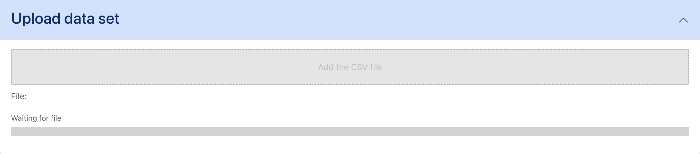
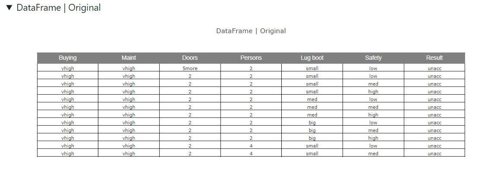
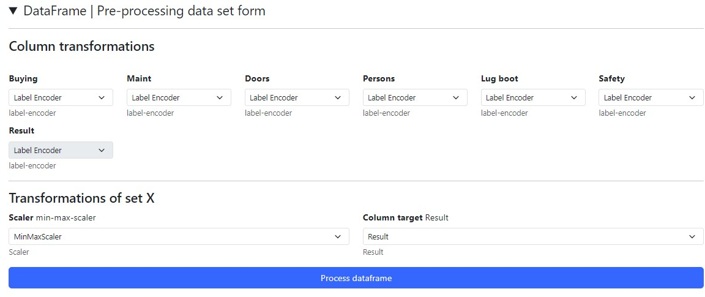
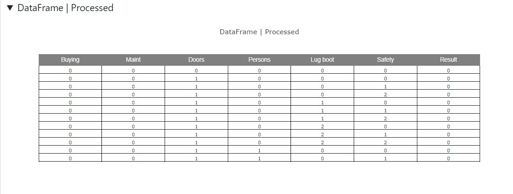

# Tabular sorting - Uploading and processing the dataset

For this tutorial we will first explain the components, the function they perform and then a simple example of how to use the application.

In this example we will use the [car evaluation](https://archive.ics.uci.edu/dataset/19/car+evaluation) dataset.

We can see a visualisation of the original dataframe without any processing.

Below is a form that allows us to perform a simple processing by columns of each of the series of the dataframe.

In this example we indicate that all its columns must be transformed to label encoder.

We also indicate that the target column to be sorted by is the "Result" column.

Finally, the processed DataFrame is displayed.

