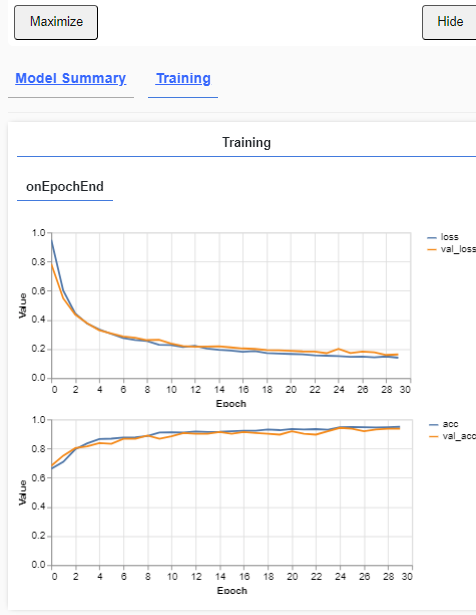
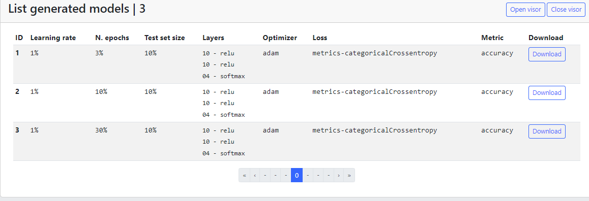

# Tabular classification - Table of models

Once everything is set up we can start the training, Nets4Learning allows to have a list of models depending on the dataset and its processing.

Once the training has started, the tensorflow js viewer will open and show the progress.

We can see the trainings we have done and which layers and parameters we have used.

