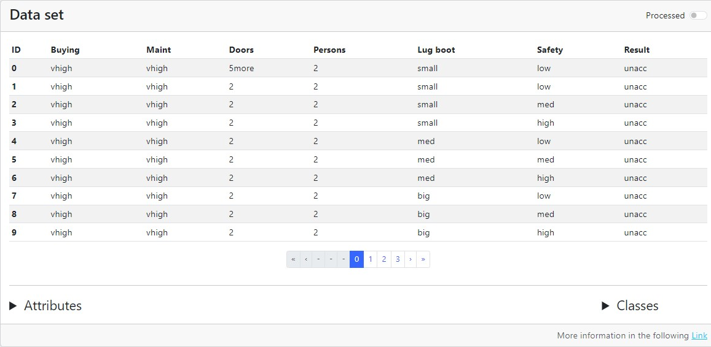
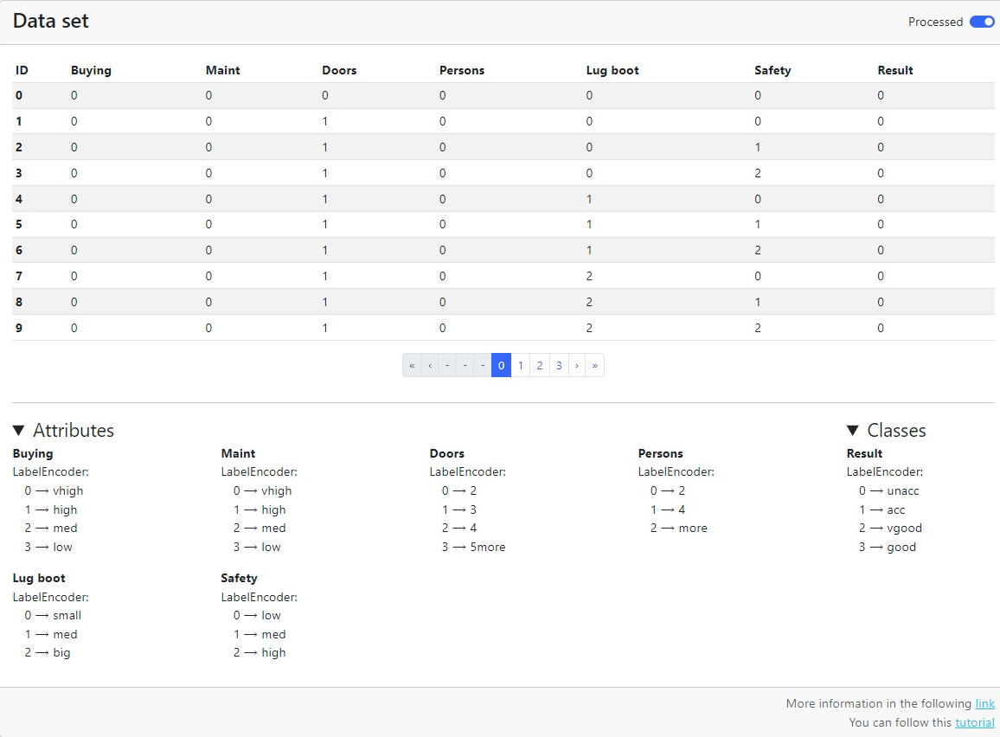

# Clasificación tabular - Visualizador del conjunto de datos

El visualizador del conjunto de datos es un componente que nos permite ver el dataframe tanto en su formato original como el dataframe procesado, incluye dos submenus con las transformaciones que se le ha hecho, así como el listado con el label-encoder si la serie es categórica.

Podemos ver el conjunto de datos procesado y como ha transformado dichas columnas.

