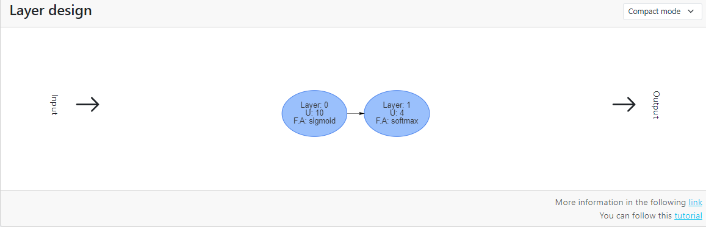
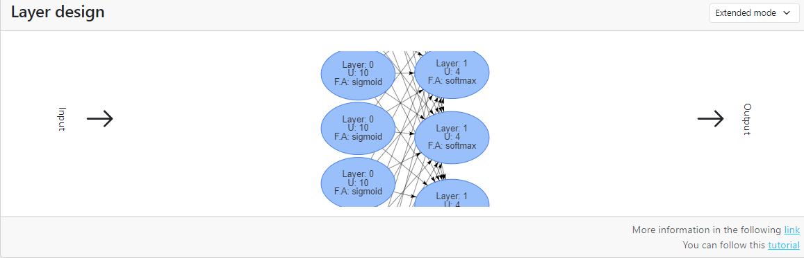

# Clasificación tabular - Visualizador de capas

El visualizador de capas es solo un componente visual para representar las capas de la red neuronal que se va a generar.

El visualizador cuenta con dos modos de visualización modo compacto o modo extendido.

En ambos modos se muestra la capa, la función de activación y el número de neuronas.

## Modo compacto

Este modo de visualización es más recomendado para dispositivos con bajas prestaciones.

## Modo extendido

En este modo se puede apreciar como cada neurona se conecta con todas las de la siguiente capa.

En la siguiente parte del tutorial se modificará la arquitectura para adaptarla a la tarea y al conjunto de datos.

