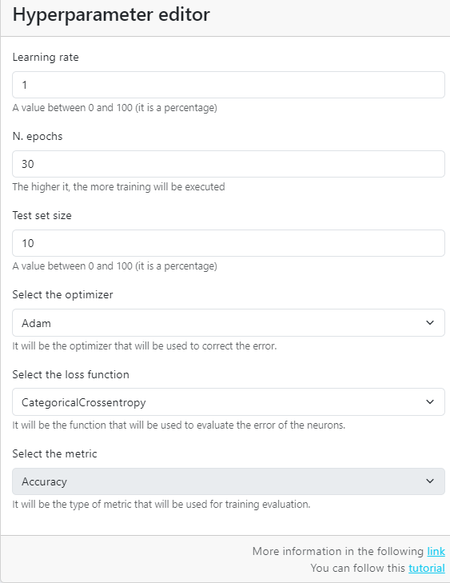

# Clasificación tabular - Editor de hiperparámetros

El editor de hiperparámetros nos permite configurar el entrenamiento del modelo.

Podemos modificar todos los parámetros del entrenamiento en esta sección.

Puedes visitar la sección del glosario para comprender cada uno de estos parámetros.

En nuestro caso dejamos la siguiente configuración para que el entrenamiento clasifique realice un ajuste muy rápido.

1. Learning rate: 1
2. Number of epochs: 30
3. Test set size: 10 → 10%
4. Optimizer: Adam
5. Loss function: CategoricalCrossentropy
6. Metric function: Accuracy

