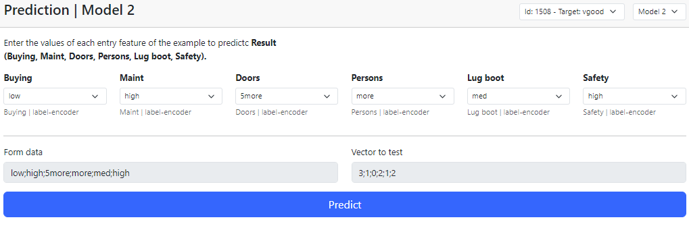
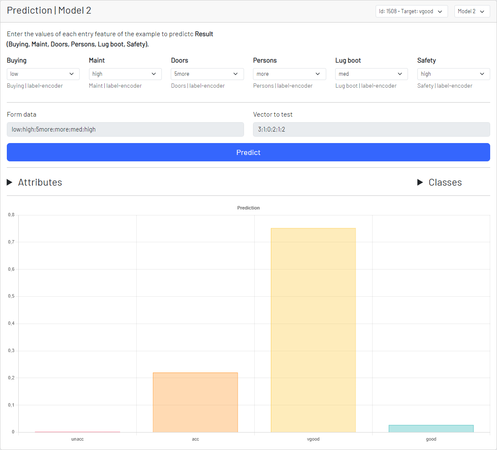

# Clasificación tabular - Predecir (clasificar)

Previamente, hemos procesado el conjunto de datos, definido la arquitectura de capas de la red neuronal del modelo, definido los hiperparámetros del entrenamiento y entrenado.

Por último podemos predecir, que en este caso se trata de una clasificación.

Nets4Learning nos permite seleccionar uno de los modelos de la lista de modelos que hemos generado, también nos permite seleccionar una instancia de la que partir, en el selector de instancias nos indica el resultado real de la clasificación, por lo que podremos compararlo con la predicción que nos
dá el modelo de clasificación.

Como podemos observar el formulario tiene una serie de campos dinámicos en función del procesamiento del conjunto de datos y dos campos extras que se encuentran bloqueados.

Estos dos campos extras indican los valores que se les va a suministrar al modelo, el primero son los datos en bruto del formulario y el segundo campo son los datos una vez se han realizado las operaciones de codificación (**label-encoder**) para transformar los datos de tipo string a un numérico
que el modelo pueda trabajar.

Por último, pero de forma interna se realiza un escalado.

Puedes visitar la sección de la documentación para comprender la programación: [ejemplo {server}](/documentation)

Por último podemos observar la predicción del modelo y el porcentaje de cada una de las clases de la clasificación.

