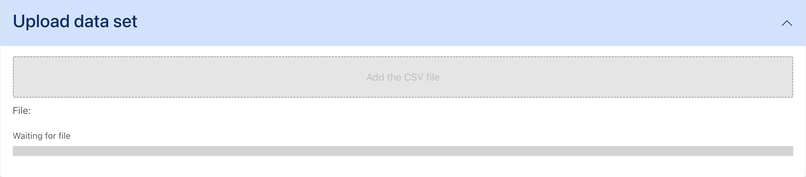
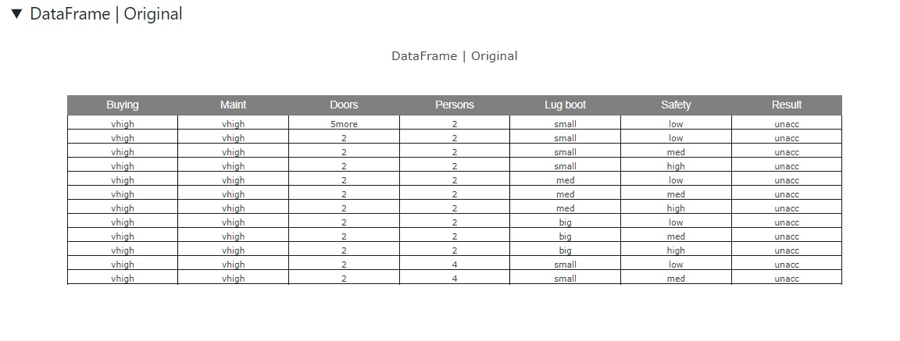
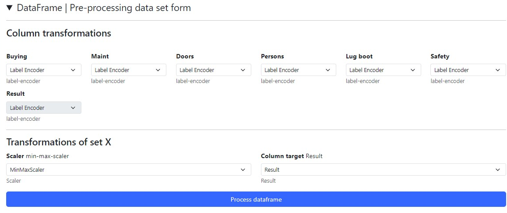
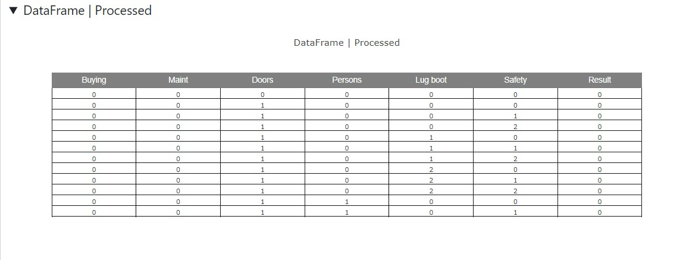

# 表形式データの分類 - データセットのアップロードと処理

このチュートリアルでは、まず各コンポーネントとその役割を説明し、そのあとでアプリケーションの簡単な使用例を紹介します。

この例では [car evaluation](https://archive.ics.uci.edu/dataset/19/car+evaluation) データセットを使用します。

まだ何も処理していない元のデータフレーム（「データフレーム | 元データ」）を確認できます。

その下には、データフレームの各系列（列）ごとに簡単な処理を行うためのフォーム（「データフレーム | 前処理フォーム」）があります。

この例では、すべての列を「ラベルエンコーダ」で変換するよう指定します。

また、分類の基準となる「予測対象の列」として「Result」列を指定します。

最後に、処理済みのデータフレーム（「データフレーム | 処理済み」）が表示されます。

