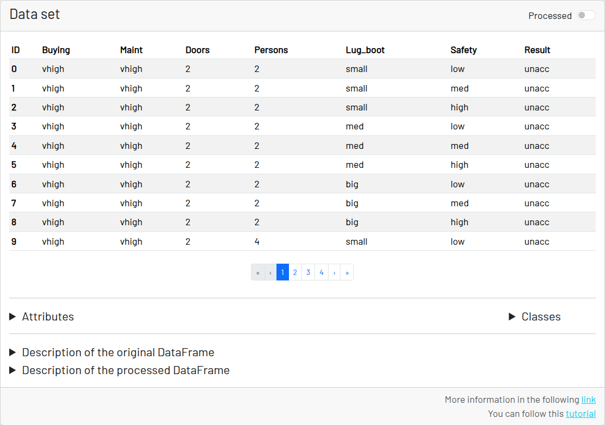
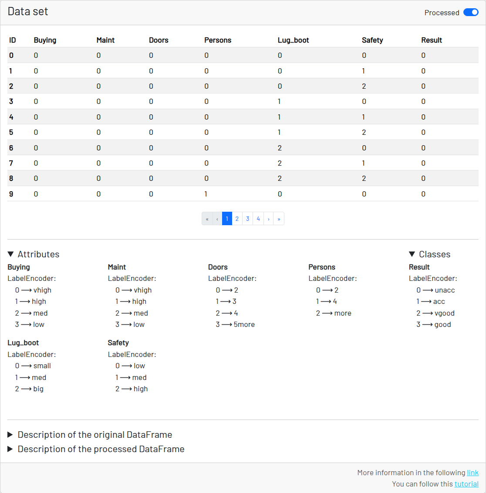

# 表形式データの分類 - データセットビューア

データセットビューア（「データセット」セクション）は、データフレームを元の形式と処理済みの形式の両方で確認できるコンポーネントです。行われた変換を示す2つのサブメニューと、系列がカテゴリ型の場合はラベルエンコーダ（label-encoder）の対応一覧も含まれています。

処理済みのデータセットと、各列がどのように変換されたかを確認できます。

