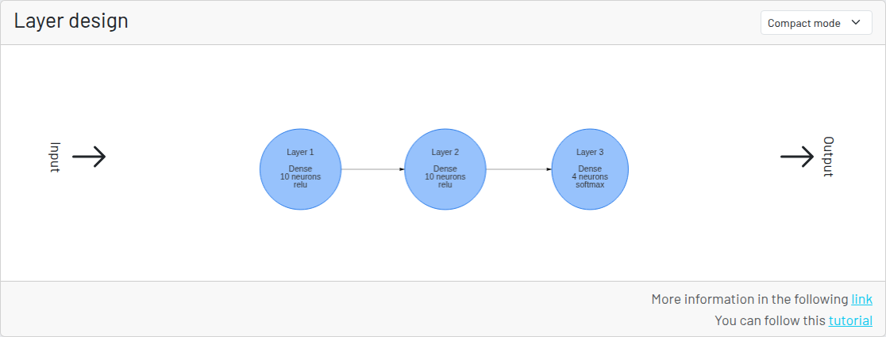
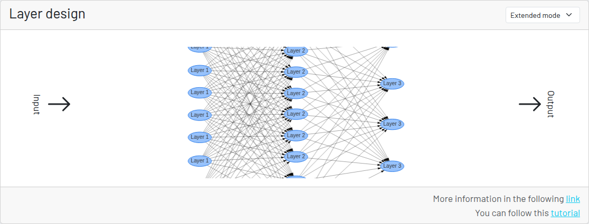

# 表形式データの分類 - レイヤービューア

レイヤービューア（「レイヤー設計」）は、生成するニューラルネットワークのレイヤーを表示するためだけの視覚的なコンポーネントです。

ビューアには、コンパクトモードと拡張モードの2つの表示モードがあります。

どちらのモードでも、レイヤー、活性化関数、ニューロン数が表示されます。

## コンパクトモード

この表示モードは、性能の低いデバイスでの使用に適しています。

## 拡張モード

このモードでは、各ニューロンが次のレイヤーのすべてのニューロンとどのように結合しているかを確認できます。

チュートリアルの次のパートでは、タスクとデータセットに合わせてアーキテクチャを変更します。