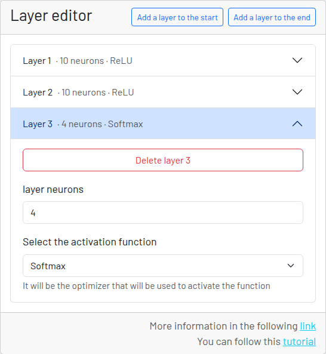
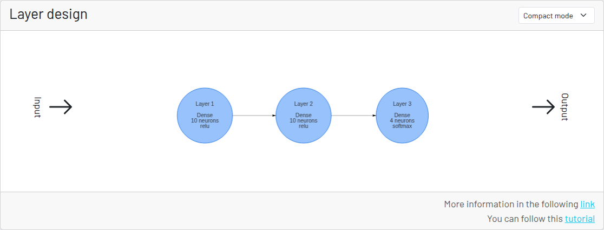

# 表形式データの分類 - レイヤーエディタ

レイヤーエディタでは、生成するモデルのニューラルネットワークアーキテクチャを構成するレイヤーを変更できます。

タスクや使用しているデータセットにどの活性化関数が最も適しているかは、用語集で確認できます。

今回は、モデルがすばやく分類を行えるように設定します。

[//]: # (デフォルトでは、レイヤーエディタには次のアーキテクチャが設定されています:)
[//]: # (1. レイヤー 1:)
[//]: # ( 1. 活性化関数: Sigmoid)
[//]: # ( 2. レイヤーニューロン: 10)
[//]: # ( 2. レイヤー 2:)
[//]: # (活性化関数: Softmax&#41; [//]: # &#40; 1. 活性化関数: Softmax&#41;)
[//]: # ( 2. レイヤーニューロン: 10)
[//]: # ()
[//]: # ( ![03-editor-layers-0.png {server}]&#40;../images/00-tabular-classification/03-editor-layers-0.png&#41;)

アーキテクチャには次の設定を行います。

1. レイヤー 1:
    1. 活性化関数: ReLU
    2. レイヤーニューロン: 10
2. レイヤー 2:
    1. 活性化関数: ReLU
    2. レイヤーニューロン: 10
3. レイヤー 3:
    1. 活性化関数: Softmax
    2. レイヤーニューロン: 4

レイヤービューアには、次の構成が表示されるはずです。

表形式データの分類モデルでは、最後のレイヤーの活性化関数を **Softmax** にし、ニューロン数を予測するクラスの数と同じにする必要があることを覚えておきましょう。
これにより、モデルの出力はクラス数と同じ長さの数値ベクトルになります。ベクトルの合計は 1（予測全体の 100%）になり、ベクトルの各要素はそのクラスに対する予測の割合を表します。