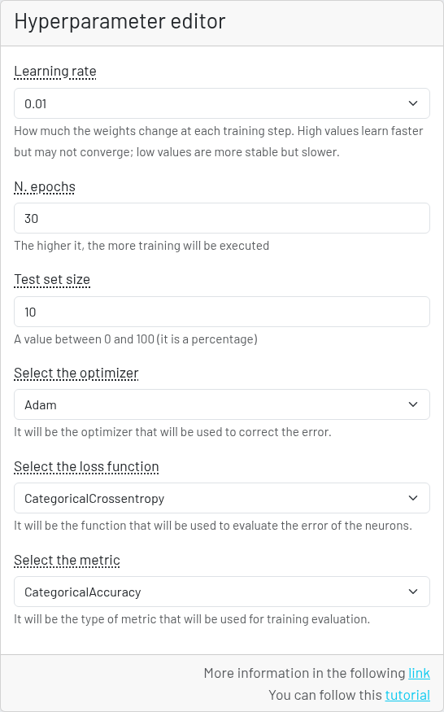

# 表形式データの分類 - ハイパーパラメータエディタ

ハイパーパラメータエディタでは、モデルの学習を設定できます。

このセクションでは、学習に関するすべてのパラメータを変更できます。

各パラメータの意味については、用語集のセクションを参照してください。

今回は、学習がすばやく調整を行えるように、次の設定にします。

1. 学習率: 0.01
2. エポック数: 30
3. テストセットサイズ: 10 → 10%
4. オプティマイザー: Adam
5. 損失関数: CategoricalCrossentropy
6. メトリクス関数: CategoricalAccuracy

