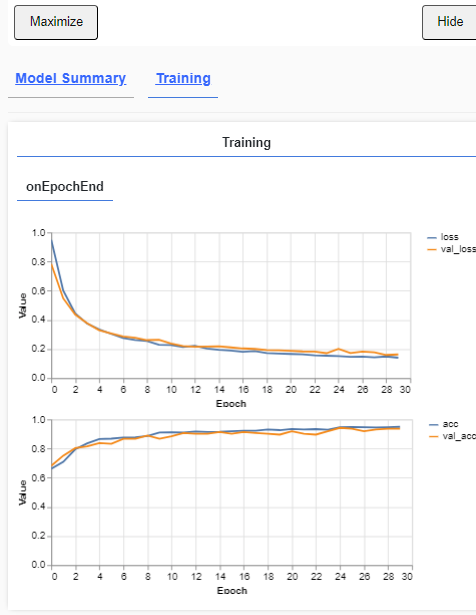
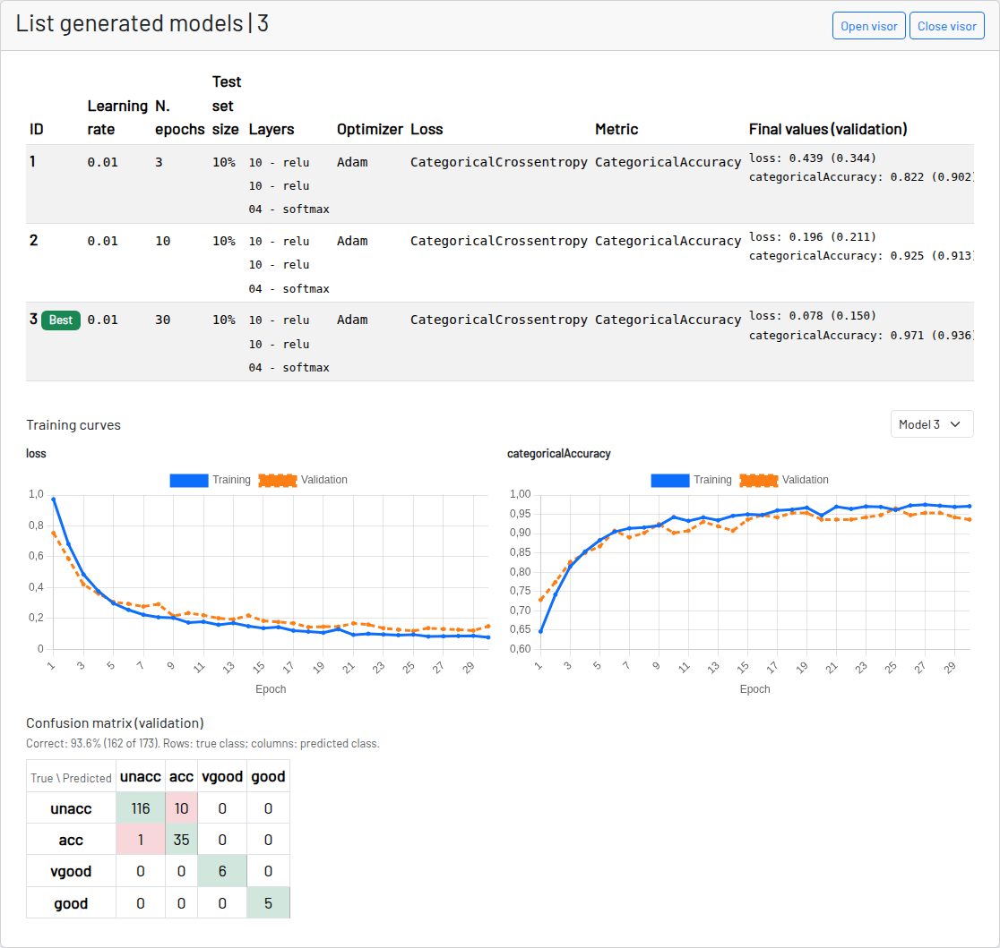

# 表形式データの分類 - モデル一覧

すべての設定が済んだら、学習を開始できます。Nets4Learning では、データセットとその処理内容に応じて、複数のモデルを一覧として保持できます。

学習を開始すると tensorflow js のビューアが開き、学習の進捗が表示されます。

「生成されたモデルの一覧」では、これまでに行った学習と、それぞれで使用したレイヤーとパラメータを確認できます。

