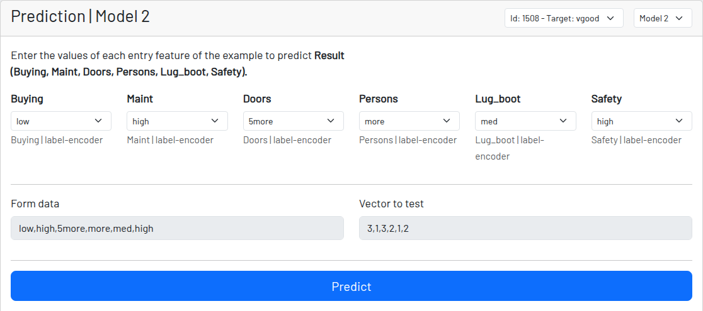
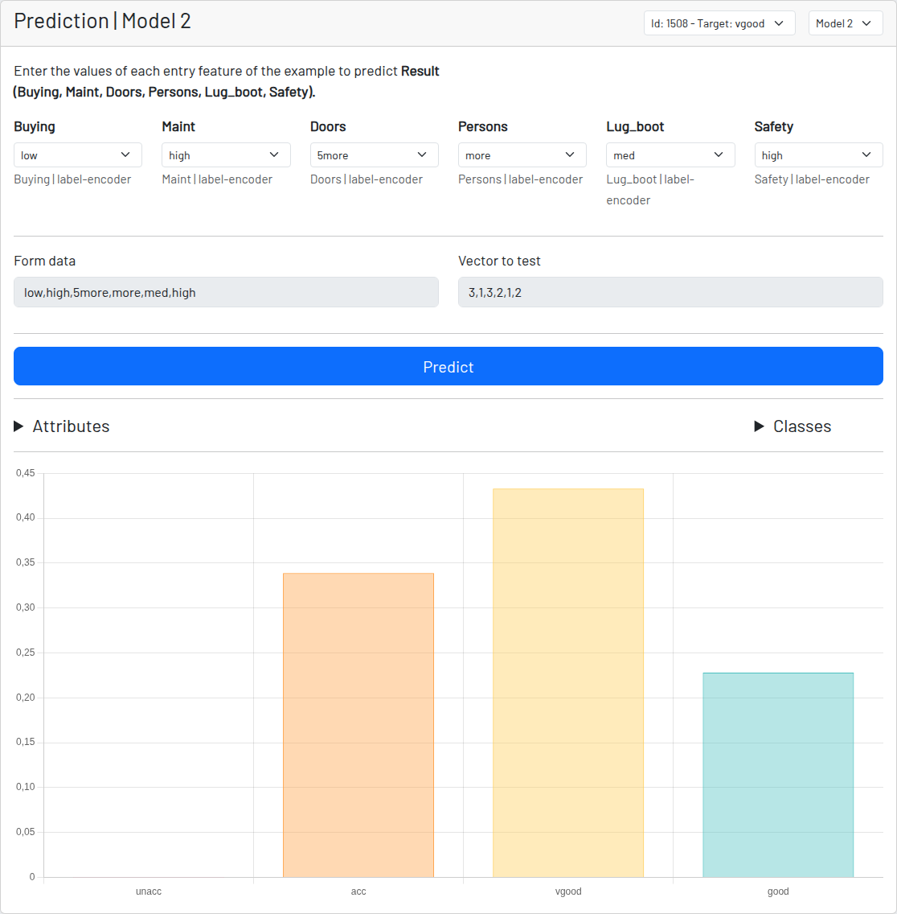

# 表形式データの分類 - 予測（分類）

ここまでで、データセットを処理し、モデルのニューラルネットワークのレイヤー構成を定義し、学習のハイパーパラメータを設定して、学習を行いました。

最後に予測を行います。今回の予測は分類です。

Nets4Learning では、生成したモデルの一覧からモデルを1つ選択できるほか、出発点となるインスタンスも選択できます。インスタンス選択には、そのインスタンスの実際の分類結果が表示されます。
そのため、分類モデルが出す予測と比較することができます。

ご覧のとおり、フォームにはデータセットの処理内容に応じた動的なフィールドと、編集できない（ロックされた）2つの追加フィールドがあります。

これら2つの追加フィールドは、モデルに与える値を示しています。1つ目はフォームの生データ（「フォームデータ」）で、2つ目は文字列データを数値に変換するエンコード処理（**label-encoder**）を行ったあとのデータ（「テストするベクトル」）です。
この変換により、モデルがデータを扱えるようになります。

最後に、内部的にスケーリングも行われます。

プログラムの仕組みについては、ドキュメントのセクションを参照してください：[例 {server}](/documentation)

最後に、モデルの予測結果と、分類の各クラスの割合を確認できます。

